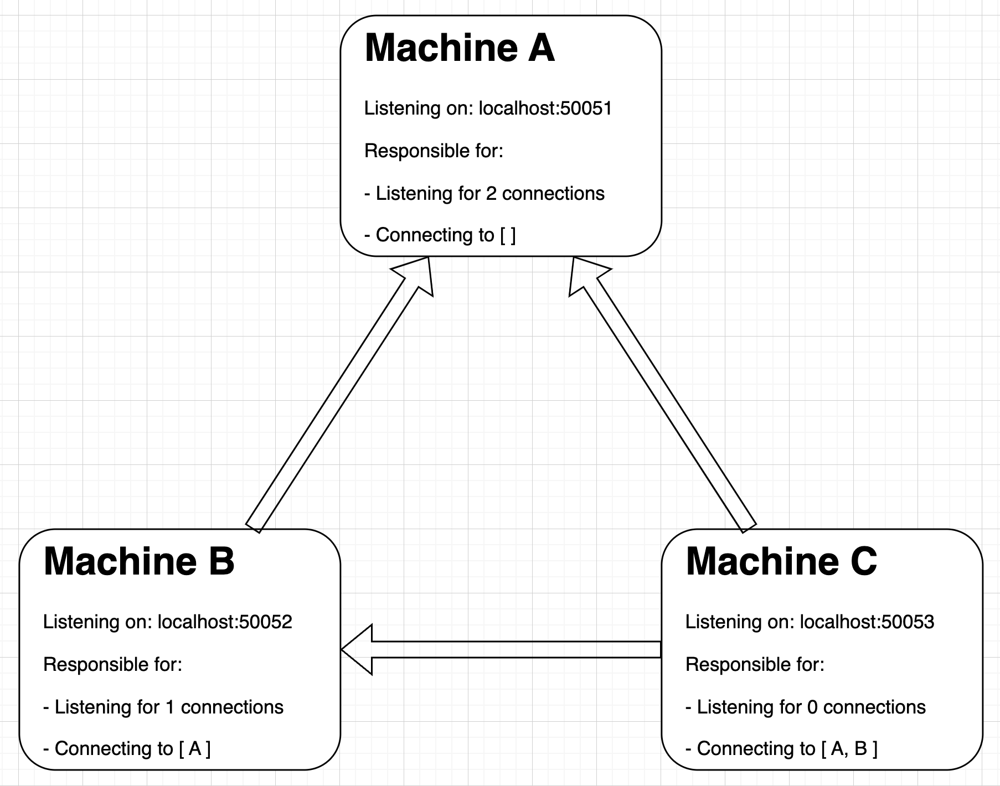

# Architecture

This document outlines the structure of our solution and important design decisions.

## Configuring Machines

### Schema

The first files to look at to understand our solution are in the `schema` folder.

`identity.py` defines what constitutes a "machine" in our experiments. Each machine has a name, which must be "A", "B", or "C" (defined in `consts.py`), a host/port on which they'll listen for connections, a number of connections they are responsible for listening _for_, and a list of strings which represents the names of machines they are responsible for connecting _to_. We'll cover how we configure these values in `consts.py` in a second. **NOTE**: Although we ran our experiments locally on a single machine, the values of `localhost` and `port` that we supported make it easily possible for this system to work over a network across different "actual machines".

`message.py` defines what constitutes a "message" sent between machines. Each message is simply the name of the machine sending it, and the logical clock time of that machine.

### Picking Constants (in `consts.py`)

In `consts.py`, we first declare the identity of the three machines used in the experiment. As shown in the above diagram, it's configured so that A will perform two listens, B will perform one listen and connect to A, and C will perform no listens and connect to both A and B. It's not hard to verify that this successfully establishes connections between all our machines.

**NOTE**: Although we only used three machines in our experiment (as set out in the spec), the `IDENTITY_MAP` model we used is flexible to handle more models. However, it's the responsibility of the user to configure the hosts, ports, numListens, and connections accordingly so that there is one connection between each machine and the machines "know" who is supposed to listen and who is supposed to connect.

`EXPERIMENT_DURATION` defines how long (in milliseconds) the experiment should last. We set this value to `70,000` for our experiments, to follow the specs requirement that it be at least a minute (since our machines may need a couple seconds to connect).

The remaining functions in `consts.py` are just quality-of-life helper functions. `get_time` just gets the epoch time in milliseconds (from the system) and `get_other_machines` is used to get all the machines in the system that are different from the machine making the call.

## Managing Connections

To keep our machine code as _clean_ as possible, we abstracted all the logic of initializing and managing connections into the `ConnectionManager` class (found in `connection_manager.py`).

### Initialization

The connection manager must be initialized with the identity of the machine it's supposed to manage connections for. On creation, it sets up a socket map (which maps the name of peer machines to the socket object), a queue of message objects, a lock for working with this msg_queue, and an `alive` flag.

To actually start the connection process, the `initialization` function must be called. It starts two threads, a `listen_thread` and a `connect_thread`.

#### The Listen Thread

The `listen_thread` (as the name suggests) listens for new connections. This is handled in the `listen` function. It simply binds itself to the host/port prescribed by its identity, and then performs an `accept` as many times as `identity.num_listens`. This is what ensures, for example, that our machine "A" does indeed perform two listens. Note that since our socket map is a dictionary it does not matter in what order the other machines connect.

Our convention is that the first thing the connecting machine do on the socket is send it's name. Thus, the first thing the listening thread does is receive a name, and use this name to update the socket map.

#### The Connect Thread

The `connect_thread` connects to peers. This is done in the `handle_connections` function. However, it's first worth describing the helper `connect` function. This function takes as input the name of a peer, then looks up that peer in the identity map, and attempts to connect to them a single time. Note that this function raises an error when given an invalid name, and also an error when the connection fails (presumably)

Because machines listen for connections one at a time, and there could be multiple machines attempting to connect to the same machine at the same time, it's possible (if not expected) that some of the calls to `connect` will fail. What the `handle_connections` function does is loop over every peer this machine is responsible for connecting for, and then on top of that keep retrying the connection once a second until it succeeds.

The connecting thread will always know the machine it connected to because of the `IDENTITY_MAP`. However, to ensure the machine it connected to knows who it is, by convention the first thing a machine does on successful connection is send it's name.

#### Handling Consumers

In the initialization function, we wait for both the listen thread and the connect thread to finish before moving on. In other words, both threads must succeed (ensuring that we do indeed have connections between every machine) before continuing.

Once we have connections, we spin up the consumers in the `handle_consumers` function. This simply means starting a new thread for every peer that the machine is connected for which will listen for messages over the socket and immediately add them to the message queue. This ensures that during our experiment, when machines are sleeping they can still receive messages instantaneously from all other machines.

### Sending / Receiving Messages

As mentioned briefly above, each machine has two threads. One of the threads simply runs the `consume` function on the attached `ConnectionManager` to ensure that messages from other machines are always immediately delivered to the queue.

The other thread is the thread that runs the actual experiment. When this thread needs to send messages to other machines, it simply takes advantage of the helper `send` funciton in the `ConnectionManager` which does the work of turning the message into a string, encoding it, and sending it over the wire.
